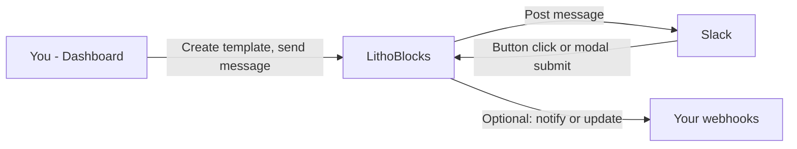

LithoBlocks lets you create, manage, and send dynamic Slack messages with interactive elements like buttons, modals, and webhooks. This page explains how your data moves and what happens when you send a message or when someone interacts in Slack.

## How data flows

You create templates and configure sample data, webhooks, and modals in the dashboard. When you send a message, LithoBlocks compiles your template with the data and delivers it to Slack. When someone clicks a button or submits a modal in Slack, LithoBlocks receives that interaction and can notify your webhooks or update the message as configured.

## How it works

**Template creation:** You create a template in the Builder; LithoBlocks stores the template and a new version so you can track history and roll back if needed.

**Message sending:** When you send a message, LithoBlocks compiles your template with the provided data, delivers it to Slack, deducts credits, and records the send.

**Button clicks:** When someone clicks a button in Slack, LithoBlocks receives the interaction, routes it using the message’s configuration, and can notify your webhooks and/or update the message as you set up.

**Modal submissions:** When someone submits a modal, LithoBlocks receives the form data and triggers the configured webhook and/or message update.

## Key concepts

- **Template versioning** — Each save creates a new version; supports history and rollback.
- **Credit system** — Compilations and sends consume credits; usage is tracked and logged per organization.
- **Metadata for interactions** — LithoBlocks attaches information to interactive messages so that when someone clicks a button or submits a modal, the action is routed correctly (e.g. to your webhook or message update).
- **Sample data** — Sample data is stored separately and can be reused across templates and structured with entities.

## Compile vs send

LithoBlocks supports two ways to use your templates:

**Compile** — Returns the compiled JSON blocks for the message (template + data from your API request). You then send that message from your own system or your own Slack app. Button interactions and webhook delivery do not work out-of-the-box; you can configure them with your own Slack app if needed.

**Send** — Uses the LithoBlocks Slack app to compile and post the message (send API, builder test send, slash command). You get full platform functionality: actions, interactivity, modals, message updates, and webhook delivery, with no additional configuration beyond connecting the LithoBlocks Slack app to your Slack organization.

For a detailed comparison and when to use which, see [Compile vs send](/architecture/compile-vs-send).

## Security

You sign in securely and your data is scoped to your organization. Slack OAuth tokens and other credentials are stored encrypted. LithoBlocks does not expose your sensitive keys.

## Further reading

- [Quickstart](/quickstart) — Get up and running with templates and Slack.
- [Templates](/guides/templates-blocks) — Blocks, placeholders, directives, and versioning.
- [Interactive buttons](/guides/interactive-buttons) — Buttons, webhooks, and message updates.
- [Modals](/guides/modals-basics) — Modal basics, data binding, and submissions.
- [API reference](/api-reference/introduction) — Send messages and manage templates via the API.
